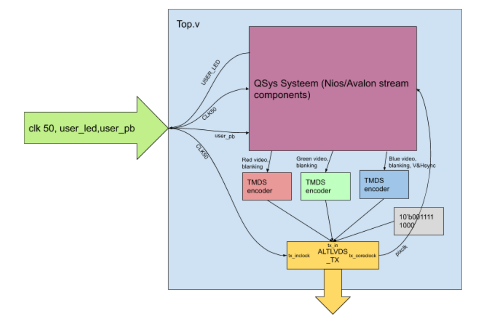
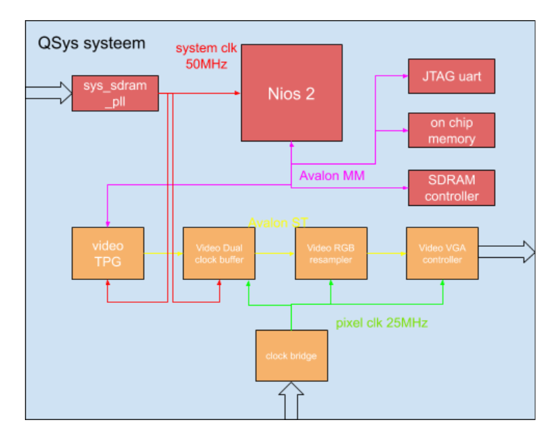

# Cyclone10_TPG
HDMI Color Bar Test Pattern generator using QMTECH Cyclone 10 Starter Kit. This code generates a 640x480 color bar on the HDMI output.
A niosII and an SDRAM controller were added but have no function what so ever currently.

Block diagram of the top level entity (top.v):

Block diagram of the QSys/"Platform Designer" system:

